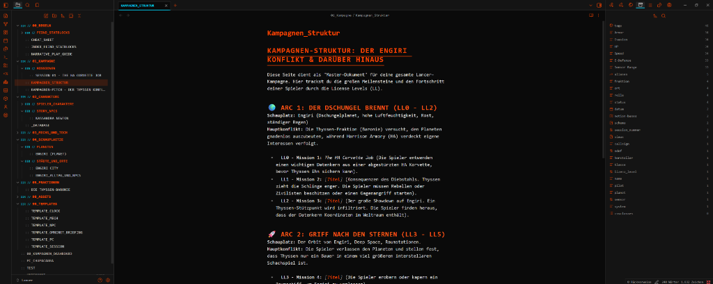

# Obsidian Lancer-OS

**Lancer-OS** is a comprehensive, all-in-one suite designed specifically for Game Masters running the [Lancer RPG](https://massif-press.itch.io/corebook-pdf-free) in [Obsidian](https://obsidian.md/). It transforms your standard markdown vault into a fully functional, dark sci-fi COMP/CON style terminal.



## 🚀 Features

### 1. Lancer-OS Theme
A custom, dark sci-fi CSS theme that completely overhauls the Obsidian UI.
- Inspired by the iconic COMP/CON aesthetic.
- Terminal-style fonts, neon orange accents, and dark backgrounds.
- Headers automatically receive the "UNION_OS //" prefix.

### 2. Interactive Clocks & Progress Bars
Manage your mission timers and progress directly in Reading View. You can render different sizes of circular clocks or linear progress bars by typing specific brackets anywhere in your notes.

**Syntax Options:**
- `[Clock: Mission Timer 4/8]` (Default Medium Clock)
- `[Clock-L: Main Objective 2/4]` (Large Clock)
- `[Clock-S: Small Timer 1/3]` (Small Clock)
- `[Bar: Health 15/20]` (Default Medium Bar)
- `[Bar-L: Boss HP 30/40]` (Large Bar)
- `[Bar-S: Minor Progress 2/5]` (Small Bar)

**Interactive:** Click the `[-]` and `[+]` buttons next to the clock in Reading View to automatically update the markdown source file! No need to switch back to Edit mode.

### 3. Automated LCP Importer
Built-in Python parser that bridges the gap between COMP/CON and Obsidian.
- Upload any `.lcp` file (like Core NPCs) via the Lancer-OS Sidebar button.
- Automatically extracts all NPCs, abilities, and weapons.
- Generates beautiful, tagged Markdown files with full YAML frontmatter.

### 4. Dynamic Statblocks & Tier Switching
Create beautiful, COMP/CON style stat grids for your mechs. To use this, simply create a code block with the language `lancer-stats`.

**Syntax:**
Provide comma-separated values to define the stats for Tier 1, Tier 2, and Tier 3.
````markdown
```lancer-stats
🤖 Basis-Stats
HP: 10, 12, 14
Armor: 1, 2, 2
Evasion: 8, 9, 10
E-Defense: 8, 9, 10
Speed: 4, 5, 5
Sensor Range: 5, 5, 5
```
````
**Interactive:** The plugin will automatically render a **[T1] [T2] [T3]** toggle switch. Click a Tier button, and the stats on the grid will instantly scale to the correct values!

### 5. Sidebar Encounter Tracker
A dedicated right-sidebar view that automatically tracks all characters in your current scene.

**How to use:**
Simply link to a character note in your current file (e.g., `[[Commander Smith]]` or `[[ASSAULT MECH]]`). The tracker reads the links and categorizes them automatically.

**File Setup Requirements:**
For the tracker to recognize the linked files, the linked notes must have specific YAML frontmatter properties at the top of the file:

*To be recognized as a **Story Character**:*
```yaml
---
tags:
  - NPC
fraktion: "Harrison Armory"
rolle: "Commander"
---
```

*To be recognized as a **Combat Mech** (with Mini-Stat Cards):*
```yaml
---
tags:
  - NPC_Class # or Mech
HP: 15
Armor: 1
Evasion: 8
E-Defense: 8
Speed: 4
---
```

**Pro-Tip:** Link a specific Tier using `[[ASSAULT MECH#T2]]`, and the Tracker will automatically load that Mech at Tier 2 for the encounter!

## 📦 Installation

### 1. Install the Theme
1. Copy the `theme` folder contents into `<Your Vault>/.obsidian/themes/Lancer-OS`.
2. Open Obsidian > Settings > Appearance > Themes, and select `Lancer-OS`.

### 2. Install the Plugin
1. Copy the `plugin` folder contents into `<Your Vault>/.obsidian/plugins/lancer-companion`.
2. Open Obsidian > Settings > Community Plugins, and enable `Lancer Companion Plugin`.

### 3. Add the Templates
1. Copy the `templates` folder contents into your Vault's template folder.

## ⚙️ Requirements
- Obsidian v1.4.0+
- Python 3 installed on your system (Required *only* if you want to use the automated LCP Importer).

## 📝 License
This project is an independent creation and is not affiliated with Massif Press. Lancer is a trademark of Massif Press.
